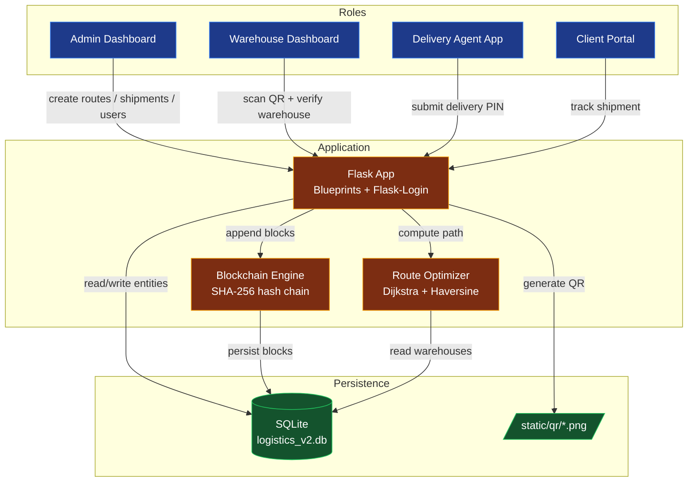
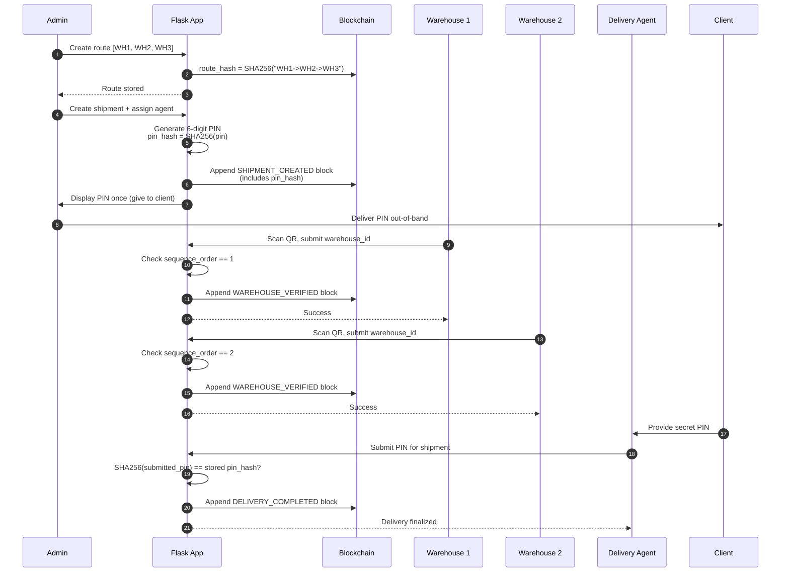

# LogiBlock — Blockchain-Based Secure Route Verification System

LogiBlock is a role-based logistics management system built with Flask and Python. It simulates an enterprise logistics network where shipments are tracked along cryptographically pre-committed routes using a custom SHA-256 hash-chain ledger to make routing violations and data tampering detectable.

> **Note on terminology:** "Blockchain" here refers to a single-node, hash-linked ledger persisted in SQLite. There is no peer-to-peer consensus or proof-of-work — see [docs/blockchain-spec.md](docs/blockchain-spec.md) for the precise design.

---

## Features

- **Multi-Role Architecture** — Four isolated web dashboards for Admins, Warehouse Staff, Delivery Agents, and Clients.
- **Secure Route Verification** — Authorized warehouse sequences are hashed and committed at route creation. Each warehouse scan is validated against the expected sequence.
- **Hash-Chain Ledger** — All shipment lifecycle events (`SHIPMENT_CREATED`, `WAREHOUSE_VERIFIED`, `ROUTE_ALERT`, `DELIVERY_COMPLETED`, `DELIVERY_FAILED_ATTEMPT`) are appended as linked blocks.
- **Tamper Detection Demo** — A simulation feature corrupts data directly in the SQLite database to demonstrate how the cryptographic chain detects anomalies.
- **PIN Hashlock Delivery** — Final delivery requires a 6-digit secret PIN whose SHA-256 hash is committed on-chain at shipment creation.
- **Route Optimization** — Dijkstra-based shortest-path computation over a K-nearest-neighbors warehouse graph using Haversine distance.
- **Real-Time Agent Navigation** — Integrated Leaflet.js maps for Delivery Agents.
- **Modern UI/UX** — TailwindCSS with a glassmorphism design system.

---

## Technology Stack

- **Backend:** Python 3, Flask, Flask-SQLAlchemy, Flask-Login
- **Database:** SQLite (V2 schema)
- **Frontend:** HTML5, TailwindCSS (CDN), FontAwesome
- **Maps:** Leaflet.js
- **Crypto / Utilities:** Python `hashlib` (SHA-256), `qrcode`, `Pillow`

---

## Architecture



See [docs/design.md](docs/design.md) for the full design rationale.

---

## Happy-Path Sequence



---

## Threat Model

A concise summary of what LogiBlock's design defends against and what it does **not**. Full discussion in [docs/design.md](docs/design.md#threat-model).

### Defended

| Threat | Mitigation |
|---|---|
| **Route tampering at scan time** — a warehouse scans out of order or an unauthorized warehouse claims a hop | `RouteWarehouse.sequence_order` check + `Shipment.next_warehouse_sequence` counter; mismatch creates a `ROUTE_ALERT` block and flips status to `Suspicious`. |
| **Ledger data tampering** — direct edit of a `BlockModel` row in SQLite | Each block hash is computed over its data and the previous block's hash. `validate_chain()` recomputes and surfaces the first broken index. |
| **Fake delivery** — agent claims delivery without reaching the client | Delivery requires a 6-digit PIN whose SHA-256 was committed at shipment creation. PIN is shared with the client out-of-band. |
| **Cross-role privilege escalation** — a delivery agent accessing admin pages | `role_required` decorator on every route; case-insensitive role comparison. |
| **Route hash forgery** — claiming a different sequence than was authorized | `route_hash = SHA256(wh_id1 -> wh_id2 -> ...)` is stored on the route at creation and referenced in `SHIPMENT_CREATED` blocks. |

### Not Defended (Known Limitations)

| Threat | Why it succeeds |
|---|---|
| **Full DB compromise + write access** | Without per-role signing keys, an attacker can append valid blocks or recompute the entire chain end-to-end. There is no external trust anchor. |
| **Admin–warehouse collusion** | An admin can edit/recreate routes; a colluding warehouse can then "verify" off-route. Multi-signature route approval would mitigate this. |
| **QR replay** | A leaked QR can be scanned by anyone with valid warehouse credentials; there is no per-scan nonce or short-lived token. |
| **PIN brute-force** | 6-digit PIN = 10⁶ space, no rate limiting on `finalize_delivery`. An attacker with the shipment ID can grind. |
| **Session forgery** | `SECRET_KEY` is hardcoded in [config.py](config.py); anyone with repo access can forge sessions. |
| **Network sniffing** | No HTTPS enforcement; PIN travels in cleartext over HTTP if deployed without TLS. |
| **Plaintext PIN at rest** | `Shipment.delivery_pin` stores the PIN alongside its hash. A DB read leaks the PIN directly. |
| **No CSRF protection** | Form POSTs (route creation, shipment creation, delivery finalize) have no CSRF tokens. |
| **Denial of service** | No rate limiting on login or PIN-submit endpoints. |

---

## Installation & Setup

1. **Clone the repository:**
   ```bash
   git clone https://github.com/yourusername/logiblock.git
   cd logiblock
   ```

2. **Set up a virtual environment:**
   ```bash
   python -m venv venv
   # Linux/macOS:
   source venv/bin/activate
   # Windows:
   venv\Scripts\activate
   ```

3. **Install dependencies:**
   ```bash
   pip install -r requirements.txt
   ```

4. **Seed warehouses (optional — users auto-seed on first run):**
   ```bash
   python seed_data.py
   ```

5. **Run the Flask server:**
   ```bash
   python app.py
   ```

6. **Access the application:**
   Open `http://127.0.0.1:5000/` in your browser.

---

## Default Test Accounts

See [credentials.txt](credentials.txt) for the pre-seeded login credentials for each of the four roles.

---

## Project Structure

```
LogiBlock/
├── app.py                 # Application factory and entry point
├── blockchain.py          # SHA-256 hash-chain ledger engine
├── config.py              # Flask config (secret key, paths, DB URI)
├── models.py              # SQLAlchemy schema (User, Warehouse, Route, Shipment, BlockModel, Alert)
├── routing.py             # Dijkstra + Haversine route optimizer
├── seed_data.py           # Warehouse seed script (25 Indian cities)
├── requirements.txt
├── routes/                # Role-isolated Flask blueprints
│   ├── auth.py            # Login / role_required decorator
│   ├── admin.py           # Admin dashboard, CRUD, chain validation
│   ├── warehouse.py       # QR verify + sequence check
│   ├── delivery.py        # Agent map + PIN hashlock
│   └── user.py            # Client tracking timeline
├── templates/             # Jinja templates (per-role subfolders)
├── static/                # CSS, generated QR codes, uploads
├── database/              # SQLite DB file
└── docs/                  # Design rationale, specs, protocols
```

---

## Documentation

- [docs/design.md](docs/design.md) — Design rationale and architectural decisions
- [docs/blockchain-spec.md](docs/blockchain-spec.md) — Block schema, hash composition, validation algorithm
- [docs/route-hash.md](docs/route-hash.md) — Route hash construction and verification
- [docs/pin-hashlock.md](docs/pin-hashlock.md) — Delivery PIN hashlock protocol
- [CHANGELOG.md](CHANGELOG.md) — Version history

---

## License

This project is intended for academic and demonstration purposes.
